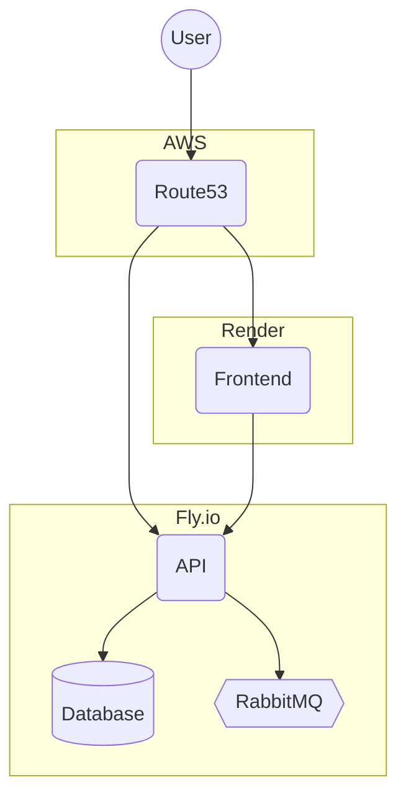

# Meal Manager - Deployment Architecture

This document outlines the infrastructure architecture for deploying the Meal Manager application using Fly.io, Render, and AWS Route53 for DNS management.

## Architecture Diagram

## Architecture Flow

1. **User sends HTTPS request** to app.yourdomain.com
2. **Route53 resolves DNS** to the Render static site via CNAME record
3. **User sends API request** to api.yourdomain.com
4. **Route53 resolves DNS** to the Fly.io API via CNAME record
5. **Frontend makes API calls** to backend endpoints
6. **API interacts with database and message broker** within Fly.io private network

## Components Description

### User/Client
- **Browser**: End users access the application through their web browsers
- **Entry Points**: Two primary domains (app.yourdomain.com and api.yourdomain.com)

### DNS Management (AWS Route53)
- **Hosted Zone**: Managed in AWS Route53 ($0.50/month)
- **DNS Records**:
  - `app.yourdomain.com` → CNAME to Render static site
  - `api.yourdomain.com` → CNAME to Fly.io API

### Frontend (Render)
- **Static Site**: Compiled React application
- **Features**:
  - Free tier for static sites
  - Auto-deploys from Git repository
  - Global CDN
  - SSL certificates included

### Backend (Fly.io)
- **API**: Java Spring Boot REST API
- **Database**: PostgreSQL database
- **Message Broker**: RabbitMQ
- **Features**:
  - Free tier with 3 VM limit
  - Persistent volumes
  - Private networking
  - SSL certificates included
  - Global edge deployment

## Resource Management

The infrastructure is managed using:

1. **Terraform** for Render resources, Fly.io resources, and Route53 DNS configuration
2. **Deployment scripts** for Fly.io Docker image deployment

## Cost Optimization

This architecture is optimized for cost-efficiency:

| Component | Provider | Monthly Cost |
|-----------|----------|--------------|
| Frontend Static Site | Render | $0 (Free tier) |
| Backend API, Database & RabbitMQ | Fly.io | $0 (Free tier) or $5+ if exceeding limits |
| DNS Management | AWS Route53 | ~$0.60 |
| **Total Estimated Cost** | | **$0.60 - $5.60+** |

## State Management

Terraform state is stored in AWS:
- S3 bucket for state files
- DynamoDB table for state locking

## Security Considerations

- All traffic is encrypted via HTTPS
- Database credentials managed via environment variables
- API authentication required for sensitive endpoints
- No direct public access to the database or message broker
- Private network between services within Fly.io 