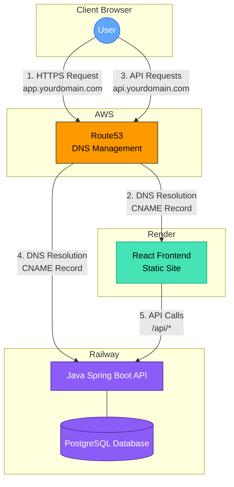

# Meal Manager - Deployment Architecture

This document outlines the infrastructure architecture for deploying the Meal Manager application using Railway, Render, and AWS Route53 for DNS management.

## Architecture Diagram

## Components Description

### User/Client
- **Browser**: End users access the application through their web browsers
- **Entry Points**: Two primary domains (app.yourdomain.com and api.yourdomain.com)

### DNS Management (AWS Route53)
- **Hosted Zone**: Managed in AWS Route53 ($0.50/month)
- **DNS Records**:
  - `app.yourdomain.com` → CNAME to Render static site
  - `api.yourdomain.com` → CNAME to Railway application

### Frontend (Render)
- **Static Site**: Compiled React application
- **Features**:
  - Free tier for static sites
  - Auto-deploys from Git repository
  - Global CDN
  - SSL certificates included

### Backend (Railway)
- **API**: Java Spring Boot REST API
- **Database**: PostgreSQL database
- **Features**:
  - Free tier (limits on compute/storage)
  - Auto-scaling when needed
  - CI/CD integration

## Resource Management

The infrastructure is managed using:

1. **Terraform** for Render resources and Route53 DNS configuration
2. **Manual configuration** or CLI for Railway resources (no Terraform provider available)

## Cost Optimization

This architecture is optimized for cost-efficiency:

| Component | Provider | Monthly Cost |
|-----------|----------|--------------|
| Frontend Static Site | Render | $0 (Free tier) |
| Backend API & Database | Railway | $0 (Free tier) or $5+ if exceeding limits |
| DNS Management | AWS Route53 | ~$0.60 |
| **Total Estimated Cost** | | **$0.60 - $5.60+** |

## State Management

Terraform state is stored in AWS:
- S3 bucket for state files
- DynamoDB table for state locking

## Security Considerations

- All traffic is encrypted via HTTPS
- Database credentials managed via Railway's secret management
- API authentication required for sensitive endpoints
- No direct public access to the database 